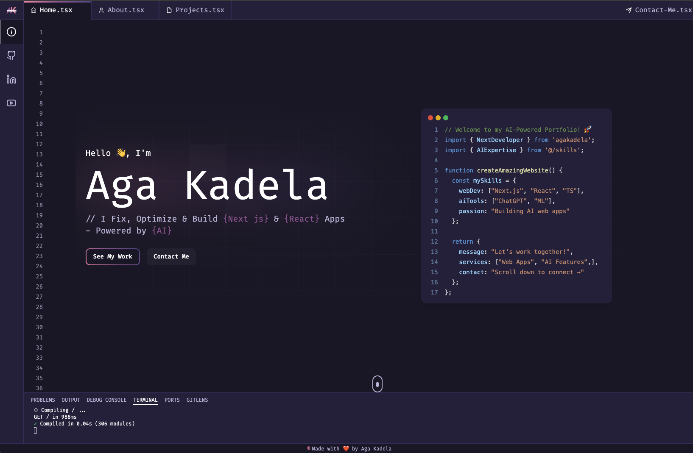

# AI-Powered Portfolio Website

A modern, interactive portfolio website built with Next.js, React, and TypeScript, featuring AI-powered components and smooth animations. The site includes an intelligent chat assistant powered by Google's Gemini AI model.

<!--  -->

## Features

- 🤖 **AI Chat Assistant** - Interactive chat powered by Google Gemini
- 🚀 **Interactive Code Typing Animation** - Dynamic code display with syntax highlighting
- 💻 **Responsive Design** - Optimized for all devices from mobile to desktop
- 🎨 **Modern UI/UX** - Clean, professional interface with smooth animations
- 🤖 **AI Integration** - AI-powered features and chat assistant
- 📱 **Mobile-First Approach** - Fully responsive with tailored mobile experience
- 🌙 **Dark Mode** - Sleek dark theme for optimal viewing
- ⚡ **Performance Optimized** - Fast loading and smooth transitions

## Tech Stack

- **Framework**: Next.js
- **Language**: TypeScript
- **Styling**: Tailwind CSS
- **Animations**: Three.js
- **Code Highlighting**: Prism React Renderer
- **UI Components**: Custom components with shadcn/ui
- **AI Model**: Google Gemini
- **Deployment**: Netlify

## Getting Started

1. **Clone the repository**

   ```bash
   git clone https://github.com/lucy-sees/nu-portfolio.git
   cd nu-portfolio
   ```

2. **Install dependencies**

   ```bash
   npm install
   # or
   yarn install
   # or
   pnpm install
   ```

3. **Set up environment variables**

   ```bash
   # Create a .env.local file with the following variables:
   RESEND_API_KEY=your_resend_api_key
   GOOGLE_API_KEY=your_gemini_api_key
   ```

4. **Start the development server**

   ```bash
   npm run dev
   # or
   yarn dev
   ```

5. **Build for production**
   ```bash
   npm run build
   # or
   yarn build
   ```

## Project Structure

- `app/` - Next.js app directory and API routes
- `components/` - React components
  - `layout/` - Layout components (header, footer, etc.)
  - `sections/` - Page sections (home, about, etc.)
  - `ui/` - Reusable UI components
- `data/` - Static data and content
- `hooks/` - Custom React hooks
- `lib/` - Utility functions
- `public/` - Static assets
- `styles/` - Global styles

## Environment Variables

The following environment variables are required:

- `RESEND_API_KEY` - API key for email service
- `GOOGLE_API_KEY` - API key for Gemini Pro AI (required for chat assistant)

## Contact

Lucy W. Mwangi

- Website: [Lucy](https://devforlio.netlify.app)
- Email me at: hello@lucy-is-a.dev (mailto: lucywanjirumwangi21@gmail.com)
- GitHub: [@lucy-sees](https://github.com/lucy-sees)

## License

This project is licensed under the MIT License - see the [LICENSE](LICENSE) file for details.

## Acknowledgments

- [Next.js](https://nextjs.org)
- [Tailwind CSS](https://tailwindcss.com)
- [Three.js](https://threejs.org/)
- [shadcn/ui](https://ui.shadcn.com)
- [Google Gemini](https://deepmind.google/technologies/gemini/)
- [Resend](https://resend.com)

---

Made with ❤️ by Lucy W. Mwangi
